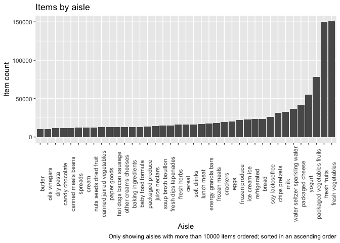

Homework 3
================
Yuki Joyama
2023-10-05

# Problem 1

**Data import setup**

``` r
library(p8105.datasets)
data("instacart") # call instacart data from the library 
```

The instacart data has 1384617 rows and 15 columns. Some key variables
include order_id, product_id, user_id, product_name, etc.

**Examples of observations in instacart dataset**

``` r
head(instacart, n = 8) |> 
  knitr::kable(digits = 1) # include table in the md file
```

| order_id | product_id | add_to_cart_order | reordered | user_id | eval_set | order_number | order_dow | order_hour_of_day | days_since_prior_order | product_name                                  | aisle_id | department_id | aisle                | department   |
|---------:|-----------:|------------------:|----------:|--------:|:---------|-------------:|----------:|------------------:|-----------------------:|:----------------------------------------------|---------:|--------------:|:---------------------|:-------------|
|        1 |      49302 |                 1 |         1 |  112108 | train    |            4 |         4 |                10 |                      9 | Bulgarian Yogurt                              |      120 |            16 | yogurt               | dairy eggs   |
|        1 |      11109 |                 2 |         1 |  112108 | train    |            4 |         4 |                10 |                      9 | Organic 4% Milk Fat Whole Milk Cottage Cheese |      108 |            16 | other creams cheeses | dairy eggs   |
|        1 |      10246 |                 3 |         0 |  112108 | train    |            4 |         4 |                10 |                      9 | Organic Celery Hearts                         |       83 |             4 | fresh vegetables     | produce      |
|        1 |      49683 |                 4 |         0 |  112108 | train    |            4 |         4 |                10 |                      9 | Cucumber Kirby                                |       83 |             4 | fresh vegetables     | produce      |
|        1 |      43633 |                 5 |         1 |  112108 | train    |            4 |         4 |                10 |                      9 | Lightly Smoked Sardines in Olive Oil          |       95 |            15 | canned meat seafood  | canned goods |
|        1 |      13176 |                 6 |         0 |  112108 | train    |            4 |         4 |                10 |                      9 | Bag of Organic Bananas                        |       24 |             4 | fresh fruits         | produce      |
|        1 |      47209 |                 7 |         0 |  112108 | train    |            4 |         4 |                10 |                      9 | Organic Hass Avocado                          |       24 |             4 | fresh fruits         | produce      |
|        1 |      22035 |                 8 |         1 |  112108 | train    |            4 |         4 |                10 |                      9 | Organic Whole String Cheese                   |       21 |            16 | packaged cheese      | dairy eggs   |

The above example shows detailed information about `order_id` = 1. As we
can see from the table, `order_id` is tied to specific IDs which
identify product, user, aisle and department. From `product_name`, we
can tell what the user got for this order. `order_number` = 4 means that
this was the 4th order from this customer. `order_dow`,
`order_hour_of_day`, and `days_since_prior` tell us that this order was
placed on the 4th week, between 10 am to 11 am, and 9 days since the
last order. `reordered` is recorded as 1 if the product has been ordered
by this user in the past, and 0 otherwise.

``` r
# summarize aisle data
df_aisles <- instacart |> 
  group_by(aisle_id, aisle) |> 
  summarise(count = n())  # count how many times aisle_id were recorded in the dataset for each id (= the number of items ordered from each aisle)

max_aisle <- max(pull(df_aisles, count)) # check maximum count of aisles

df_aisles_max <- df_aisles |> 
  filter(count == max_aisle) # filter by the maximum count of aisles
```

134 aisles are in this dataset, and **fresh vegetables** are the most
items (in total 150609 items) ordered from.

The following plot shows the number of items ordered in each aisle,
limiting this to aisles with more than 10000 items ordered.

``` r
# make a plot (the number of items ordered in each aisle)
df_aisles |> 
  filter(count > 10000) |> # just show aisles with more than 10000 items 
  ggplot(aes(x = reorder(aisle, count), y = count)) + 
  geom_bar(stat = "identity") +
  theme(axis.text.x = element_text(angle = 90)) +
  labs(
    title = "Items by aisle",
    x = "Aisle",
    y = "Item count",
    caption = "Only showing aisles with more than 10000 items ordered; sorted in an ascending order"
  )
```

<!-- -->

**Popular items in “baking ingredients”**

``` r
# table showing the three most popular items in "baking ingredients"
df_baking_ingredients <- instacart |> 
  filter(aisle == c("baking ingredients")) |> # filter by aisle
  group_by(product_name) |> 
  summarise(count = n()) |> # add count for each item
  arrange(desc(count)) |> # arrange in descending order
  head(n = 3) # only show the first three items
  
df_baking_ingredients |> 
  knitr::kable(digits = 1) # show table in md file 
```

| product_name      | count |
|:------------------|------:|
| Light Brown Sugar |   499 |
| Pure Baking Soda  |   387 |
| Cane Sugar        |   336 |

The three most popular items in “baking ingredients” are Light Brown
Sugar, Pure Baking Soda, Cane Sugar.

**Popular items in “dog food care”**

``` r
# table showing the three most popular items in "dog food care"
df_dog_food_care <- instacart |> 
  filter(aisle == c("dog food care")) |> # filter by aisle
  group_by(product_name) |> 
  summarise(count = n()) |> # add count for each item
  arrange(desc(count)) |> # arrange in descending order
  head(n = 3) # only show the first three items
  
df_dog_food_care |> 
  knitr::kable(digits = 1) # show table in md file 
```

| product_name                                  | count |
|:----------------------------------------------|------:|
| Snack Sticks Chicken & Rice Recipe Dog Treats |    30 |
| Organix Chicken & Brown Rice Recipe           |    28 |
| Small Dog Biscuits                            |    26 |

The three most popular items in “dog food care” are Snack Sticks Chicken
& Rice Recipe Dog Treats, Organix Chicken & Brown Rice Recipe, Small Dog
Biscuits.

**Popular items in “packaged vegetables fruits”**

``` r
# table showing the three most popular items in "packaged vegetables fruits"
df_packaged_vegetables_fruits <- instacart |> 
  filter(aisle == c("packaged vegetables fruits")) |> # filter by aisle
  group_by(product_name) |> 
  summarise(count = n()) |> # add count for each item
  arrange(desc(count)) |> # arrange in descending order
  head(n = 3) # only show the first three items
  
df_packaged_vegetables_fruits |> 
  knitr::kable(digits = 1) # show table in md file 
```

| product_name         | count |
|:---------------------|------:|
| Organic Baby Spinach |  9784 |
| Organic Raspberries  |  5546 |
| Organic Blueberries  |  4966 |

The three most popular items in “packaged vegetables fruits” are Organic
Baby Spinach, Organic Raspberries, Organic Blueberries.

The table below provides the mean order time for Pink Lady Apples and
Coffee Ice Cream on each day of the week:

**Pink Lady Apples**

``` r
# Pink Lady Apples and Coffee Ice Cream table
pink_lady_apples <- instacart |> 
  filter(product_name == c("Pink Lady Apples")) |> # filter by product name
  select(-product_name) |> 
  group_by(order_dow) |> 
  summarise("mean_hour" = mean(order_hour_of_day)) # show the mean hour of the day on each day of the week

pink_lady_apples |> 
  knitr::kable(digits = 1) # show table in md file 
```

| order_dow | mean_hour |
|----------:|----------:|
|         0 |      13.4 |
|         1 |      11.4 |
|         2 |      11.7 |
|         3 |      14.2 |
|         4 |      11.6 |
|         5 |      12.8 |
|         6 |      11.9 |

**Coffee Ice Cream**

``` r
# Pink Lady Apples and Coffee Ice Cream table
coffee_ice_cream <- instacart |> 
  filter(product_name == c("Coffee Ice Cream")) |> # filter by product name
  select(-product_name) |> 
  group_by(order_dow) |> 
  summarise("mean_hour" = mean(order_hour_of_day)) # show the mean hour of the day on each day of the week


coffee_ice_cream |> 
  knitr::kable(digits = 1) # show table in md file 
```

| order_dow | mean_hour |
|----------:|----------:|
|         0 |      13.8 |
|         1 |      14.3 |
|         2 |      15.4 |
|         3 |      15.3 |
|         4 |      15.2 |
|         5 |      12.3 |
|         6 |      13.8 |

# Problem 2

**Data import setup**

``` r
library(p8105.datasets)
data("brfss_smart2010") # call BRFSS data from the library 
```

**Data cleaning**

``` r
df_brfss_cleaned <- brfss_smart2010 |> 
  janitor::clean_names()
```
