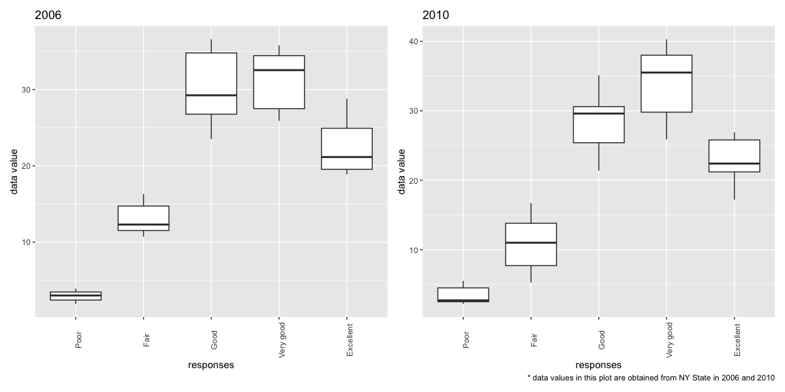
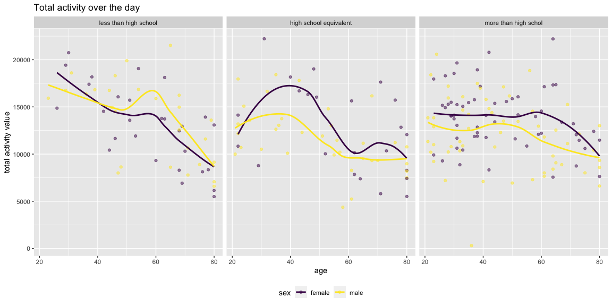
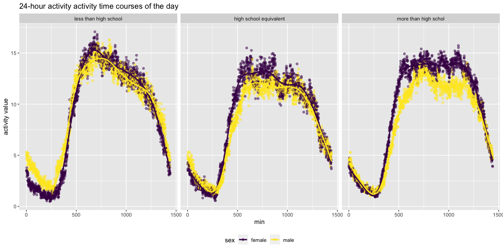

Homework 3
================
Yuki Joyama
2023-10-05

# Problem 1

**Data import setup**

``` r
library(p8105.datasets)
data("instacart") # call instacart data from the library 
```

The instacart data has 1384617 rows and 15 columns. Some key variables
include order_id, product_id, user_id, product_name, etc.

**Examples of observations in instacart dataset**

``` r
head(instacart, n = 8) |> 
  knitr::kable(digits = 1) # include table in the md file
```

| order_id | product_id | add_to_cart_order | reordered | user_id | eval_set | order_number | order_dow | order_hour_of_day | days_since_prior_order | product_name                                  | aisle_id | department_id | aisle                | department   |
|---------:|-----------:|------------------:|----------:|--------:|:---------|-------------:|----------:|------------------:|-----------------------:|:----------------------------------------------|---------:|--------------:|:---------------------|:-------------|
|        1 |      49302 |                 1 |         1 |  112108 | train    |            4 |         4 |                10 |                      9 | Bulgarian Yogurt                              |      120 |            16 | yogurt               | dairy eggs   |
|        1 |      11109 |                 2 |         1 |  112108 | train    |            4 |         4 |                10 |                      9 | Organic 4% Milk Fat Whole Milk Cottage Cheese |      108 |            16 | other creams cheeses | dairy eggs   |
|        1 |      10246 |                 3 |         0 |  112108 | train    |            4 |         4 |                10 |                      9 | Organic Celery Hearts                         |       83 |             4 | fresh vegetables     | produce      |
|        1 |      49683 |                 4 |         0 |  112108 | train    |            4 |         4 |                10 |                      9 | Cucumber Kirby                                |       83 |             4 | fresh vegetables     | produce      |
|        1 |      43633 |                 5 |         1 |  112108 | train    |            4 |         4 |                10 |                      9 | Lightly Smoked Sardines in Olive Oil          |       95 |            15 | canned meat seafood  | canned goods |
|        1 |      13176 |                 6 |         0 |  112108 | train    |            4 |         4 |                10 |                      9 | Bag of Organic Bananas                        |       24 |             4 | fresh fruits         | produce      |
|        1 |      47209 |                 7 |         0 |  112108 | train    |            4 |         4 |                10 |                      9 | Organic Hass Avocado                          |       24 |             4 | fresh fruits         | produce      |
|        1 |      22035 |                 8 |         1 |  112108 | train    |            4 |         4 |                10 |                      9 | Organic Whole String Cheese                   |       21 |            16 | packaged cheese      | dairy eggs   |

The above example shows detailed information about `order_id` = 1. As we
can see from the table, `order_id` is tied to specific IDs which
identify product, user, aisle and department. From `product_name`, we
can tell what the user got for this order. `order_number` = 4 means that
this was the 4th order from this customer. `order_dow`,
`order_hour_of_day`, and `days_since_prior` tell us that this order was
placed on the 4th week, between 10 am to 11 am, and 9 days since the
last order. `reordered` is recorded as 1 if the product has been ordered
by this user in the past, and 0 otherwise.

``` r
# summarize aisle data
df_aisles <- instacart |> 
  group_by(aisle_id, aisle) |> 
  summarise(count = n())  # count how many times aisle_id were recorded in the dataset for each id (= the number of items ordered from each aisle)

max_aisle <- max(pull(df_aisles, count)) # check maximum count of aisles

df_aisles_max <- df_aisles |> 
  filter(count == max_aisle) # filter by the maximum count of aisles
```

134 aisles are in this dataset, and **fresh vegetables** are the most
items (in total 150609 items) ordered from.

The following plot shows the number of items ordered in each aisle,
limiting this to aisles with more than 10000 items ordered.

``` r
# make a plot (the number of items ordered in each aisle)
df_aisles |> 
  filter(count > 10000) |> # just show aisles with more than 10000 items 
  ggplot(aes(x = reorder(aisle, count), y = count)) + 
  geom_bar(stat = "identity") +
  theme(axis.text.x = element_text(angle = 90)) +
  labs(
    title = "Items by aisle",
    x = "Aisle",
    y = "Item count",
    caption = "Only showing aisles with more than 10000 items ordered; sorted in an ascending order"
  )
```

<!-- -->

**Popular items in “baking ingredients”**

``` r
# table showing the three most popular items in "baking ingredients"
df_baking_ingredients <- instacart |> 
  filter(aisle == c("baking ingredients")) |> # filter by aisle
  group_by(product_name) |> 
  summarise(count = n()) |> # add count for each item
  arrange(desc(count)) |> # arrange in descending order
  head(n = 3) # only show the first three items
  
df_baking_ingredients |> 
  knitr::kable(digits = 1) # show table in md file 
```

| product_name      | count |
|:------------------|------:|
| Light Brown Sugar |   499 |
| Pure Baking Soda  |   387 |
| Cane Sugar        |   336 |

The three most popular items in “baking ingredients” are Light Brown
Sugar, Pure Baking Soda, Cane Sugar.

**Popular items in “dog food care”**

``` r
# table showing the three most popular items in "dog food care"
df_dog_food_care <- instacart |> 
  filter(aisle == c("dog food care")) |> # filter by aisle
  group_by(product_name) |> 
  summarise(count = n()) |> # add count for each item
  arrange(desc(count)) |> # arrange in descending order
  head(n = 3) # only show the first three items
  
df_dog_food_care |> 
  knitr::kable(digits = 1) # show table in md file 
```

| product_name                                  | count |
|:----------------------------------------------|------:|
| Snack Sticks Chicken & Rice Recipe Dog Treats |    30 |
| Organix Chicken & Brown Rice Recipe           |    28 |
| Small Dog Biscuits                            |    26 |

The three most popular items in “dog food care” are Snack Sticks Chicken
& Rice Recipe Dog Treats, Organix Chicken & Brown Rice Recipe, Small Dog
Biscuits.

**Popular items in “packaged vegetables fruits”**

``` r
# table showing the three most popular items in "packaged vegetables fruits"
df_packaged_vegetables_fruits <- instacart |> 
  filter(aisle == c("packaged vegetables fruits")) |> # filter by aisle
  group_by(product_name) |> 
  summarise(count = n()) |> # add count for each item
  arrange(desc(count)) |> # arrange in descending order
  head(n = 3) # only show the first three items
  
df_packaged_vegetables_fruits |> 
  knitr::kable(digits = 1) # show table in md file 
```

| product_name         | count |
|:---------------------|------:|
| Organic Baby Spinach |  9784 |
| Organic Raspberries  |  5546 |
| Organic Blueberries  |  4966 |

The three most popular items in “packaged vegetables fruits” are Organic
Baby Spinach, Organic Raspberries, Organic Blueberries.

The table below provides the mean order time for Pink Lady Apples and
Coffee Ice Cream on each day of the week:

**Pink Lady Apples and Coffee Ice Cream table**

``` r
# Pink Lady Apples and Coffee Ice Cream table
instacart |> 
  filter(product_name %in% c("Pink Lady Apples", "Coffee Ice Cream")) |> # filter by product name
  group_by(product_name, order_dow) |> 
  summarise("mean_hour" = mean(order_hour_of_day)) |> # show the mean hour of the day on each day of the week
  pivot_wider(
    names_from = order_dow, 
    values_from = mean_hour
  ) |> 
  knitr::kable(digits = 1) # show table in md file 
```

| product_name     |    0 |    1 |    2 |    3 |    4 |    5 |    6 |
|:-----------------|-----:|-----:|-----:|-----:|-----:|-----:|-----:|
| Coffee Ice Cream | 13.8 | 14.3 | 15.4 | 15.3 | 15.2 | 12.3 | 13.8 |
| Pink Lady Apples | 13.4 | 11.4 | 11.7 | 14.2 | 11.6 | 12.8 | 11.9 |

# Problem 2

**Data import setup**

``` r
library(p8105.datasets)
data("brfss_smart2010") # call BRFSS data from the library 
```

**Data cleaning**

``` r
df_brfss_cleaned <- brfss_smart2010 |> 
  janitor::clean_names() |> 
  filter(topic == "Overall Health" & response %in% c("Excellent", "Very good", "Good", "Fair", "Poor")) |>  # focus on Overall Health; only include responses from "Excellent" to "Poor"
  mutate(
    response = factor(response, levels = c("Poor", "Fair", "Good", "Very good", "Excellent")) # change response as factor taking levels ordered from “Poor” to “Excellent”
  )
```

- In 2002, which states were observed at 7 or more locations? What about
  in 2010?

``` r
# check 2002
df_brfss_2002 <- df_brfss_cleaned |> 
  filter(year == 2002) |>  # filter by year 
  group_by(locationabbr) |> # group by states
  summarise(count = n() / 5) |> # count number of observations in each state
  filter(count >= 7) # show states which have >= 7 locations

# check 2010
df_brfss_2010 <- df_brfss_cleaned |> 
  filter(year == 2010) |>  # filter by year 
  group_by(locationabbr) |> # group by states
  summarise(count = n() / 5) |> # count number of observations in each state
  filter(count >= 7) # show states which have >= 7 locations
```

7 or more locations were observed in CT, FL, MA, NC, NJ, PA in 2002; CA,
CO, FL, MA, MD, NC, NE, NJ, NY, OH, PA, SC, TX, WA in 2010.

- Construct a dataset that is limited to `Excellent` responses, and
  contains, year, state, and a variable that averages the `data_value`
  across locations within a state. Make a “spaghetti” plot of this
  average value over time within a state (that is, make a plot showing a
  line for each state across years).

``` r
# create a dataset that is limited to "Excellent" responses
df_brfss_excellent <- df_brfss_cleaned |> 
  filter(response == "Excellent") |> # filter by response "Excellent"
  select(year, locationabbr, data_value) |> # only include necessary variables in the dataset
  group_by(locationabbr, year) |> 
  drop_na() |> # drop the missing values so that we can calculate mean value
  summarise(value_mean = mean(data_value)) # calculate mean data_value across locations within a state

# create a spaghetti plot with x being year, y being the value_mean
df_brfss_excellent |> 
  rename("state" = locationabbr) |> # renamed column for plot output
  ggplot(aes(x = year, y = value_mean, group = state, color = state)) + 
  geom_point() + # spaghetti plot
  geom_line() +
  theme(legend.text = element_text(size = 6)) + # changed legend text size
  guides(color = guide_legend(ncol = 3)) + # changed the number of legend columns
  labs(
    title = "The average value over time within a state",
    x = "Year",
    y = "The average value",
    caption = "Only showing data with Excellent response"
  ) 
```

<!-- -->

- Make a two-panel plot showing, for the years 2006, and 2010,
  distribution of `data_value` for responses (“Poor” to “Excellent”)
  among locations in NY State.

``` r
library(patchwork) # to create a two-panel plot

# prepare a dataset for plot
df_ny_2006 <- df_brfss_cleaned |> 
  filter(locationabbr == "NY" & year == 2006)  # only include 2006 data in NY
  
df_ny_2010 <- df_brfss_cleaned |> 
  filter(locationabbr == "NY" & year == 2010)  # only include 2006 data in NY
  
# plot for 2006
p_ny_2006 = df_ny_2006 |> 
  ggplot(aes(x = locationdesc, y = data_value, fill = response)) +
  geom_bar(stat = "identity", position = "dodge") +
  theme(legend.position = "bottom", axis.text.x = element_text(angle = 90)) + # change the legend location
  labs(
    title = "2006",
    x = "Location",
  ) +
  viridis::scale_fill_viridis(discrete = TRUE)

# plot for 2010
p_ny_2010 = df_ny_2010 |> 
  ggplot(aes(x = locationdesc, y = data_value, fill = response)) +
  geom_bar(stat = "identity", position = "dodge") +
  theme(legend.position = "bottom", axis.text.x = element_text(angle = 90)) + # change the legend location
  labs(
    title = "2010",
    x = "Location",
  ) +
  viridis::scale_fill_viridis(discrete = TRUE)

p_ny_2006 + p_ny_2010 # put two plots side by side
```

<!-- -->

# Problem 3

**Data import and cleaning**

``` r
# import and clean demographic data
df_covar = read_csv("./data/nhanes_covar.csv", skip = 4) |> # import csv file
  janitor::clean_names() |> 
  mutate(
    sex = case_match(  
      sex,
      1 ~ "male",
      2 ~ "female"
    ),  # rewrite sex variables
    education = case_match(
      education,
      1 ~ "less than high school",
      2 ~ "high school equivalent",
      3 ~ "more than high schol"
    ), # rewrite education variables
    education = factor(education, levels = c("less than high school", "high school equivalent", "more than high schol")) 
  ) |> # change education to factor variable
  drop_na() |> # exclude those with missing demographic data
  filter(age >= 21)

# import and clean accelerometer data
df_accel = read_csv("./data/nhanes_accel.csv") |> # import csv file
  janitor::clean_names() |> 
  pivot_longer( # change the dataset from wide to long
    min1:min1440,
    names_to = "min",
    values_to = "mims_values",
    names_transform = list(min = ~as.numeric(gsub("min", "", .))) # just show numbers in the min column
  )

# merge the two datasets
df_mims_cleaned =  
  left_join(df_covar, df_accel, by = "seqn")
```

**The number of men and women in each educaiton category**

``` r
df_mims_cleaned |> 
  group_by(sex, education) |> # group by sex and education
  summarise(count = n()) |> 
  pivot_wider( # change the table from long to wide
    names_from = education, 
    values_from = count
  ) |> 
  knitr::kable(digits = 1)
```

| sex    | less than high school | high school equivalent | more than high schol |
|:-------|----------------------:|-----------------------:|---------------------:|
| female |                 40320 |                  33120 |                84960 |
| male   |                 38880 |                  50400 |                80640 |

The table shows the number of men and women in each education category.
The number of people who received more than high school education was
the largest in both sex.

**The age distribution**

``` r
# male
age_male = df_mims_cleaned |> 
  filter(sex == "male") |> 
  ggplot(aes(x = education, y = age)) +
  geom_boxplot(aes(fill = education), alpha = .5) + # make a boxplot for male
  labs(
    title = "Male"
  ) +
  theme(legend.position = "bottom") +
  viridis::scale_fill_viridis(discrete = TRUE)
  
# female
age_female = df_mims_cleaned |> 
  filter(sex == "female") |> 
  ggplot(aes(x = education, y = age)) +
  geom_boxplot(aes(fill = education), alpha = .5) + # make a boxplot for female
  labs(
    title = "Female"
  ) +
  theme(legend.position = "bottom") +
  viridis::scale_fill_viridis(discrete = TRUE)

age_male + age_female # combine two graphs
```

<!-- -->
The boxplot shows that among male, the lower the education level is, the
older the age is. Among female, those who received high school
equivalent education appears to have the highest median age.

**Total activity**

``` r
df_mims_cleaned |> 
  group_by(seqn) |> 
  mutate(
    total_values = sum(mims_values) 
  ) |> # added a column that sums up mims_values for each individual
  ggplot(aes(x = age, y = total_values, color = sex)) +
  geom_point(alpha = .5) +
  geom_smooth(se = F) +
  facet_grid(~ education) +
  labs(
    title = "Total activity over the day",
    y = "total activity value"
  ) +
  theme(legend.position = "bottom") +
  viridis::scale_color_viridis(
    discrete = TRUE
  )
```

<!-- -->

**24-hour activity time courses**

``` r
df_mims_cleaned |> 
  group_by(min, sex, education) |> 
  mutate(
    total_values = sum(mims_values) 
  ) |> # added a column that sums up mims_values for each individual
  ggplot(aes(x = min, y = total_values, color = sex)) +
  geom_point(alpha = .1) +
  geom_smooth(se = F) +
  facet_grid(~ education) +
  labs(
    title = "24-hour activity activity time courses of the day",
    y = "total activity value"
  ) +
  theme(legend.position = "bottom") +
  viridis::scale_color_viridis(
    discrete = TRUE
  )
```

<!-- -->

``` r
  
df_mims_cleaned |> 
  mutate(hour = min %/% 60) |> 
  group_by(hour, sex, education) |> 
  mutate(total_values = sum(mims_values)) |> 
  ggplot(aes(x = hour, y = total_values, color = sex)) +
  geom_point(alpha = .1) +
  geom_smooth(se = F) +
  facet_grid(~ education) +
  labs(
    title = "24-hour activity activity time courses of the day",
    y = "total activity value"
  ) +
  theme(legend.position = "bottom") +
  scale_x_continuous(limits = c(0, 24)) +
  viridis::scale_color_viridis(
    discrete = TRUE
  )
```

<!-- -->
